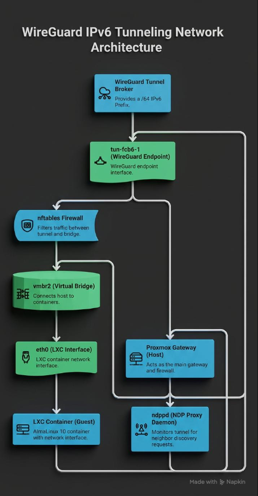
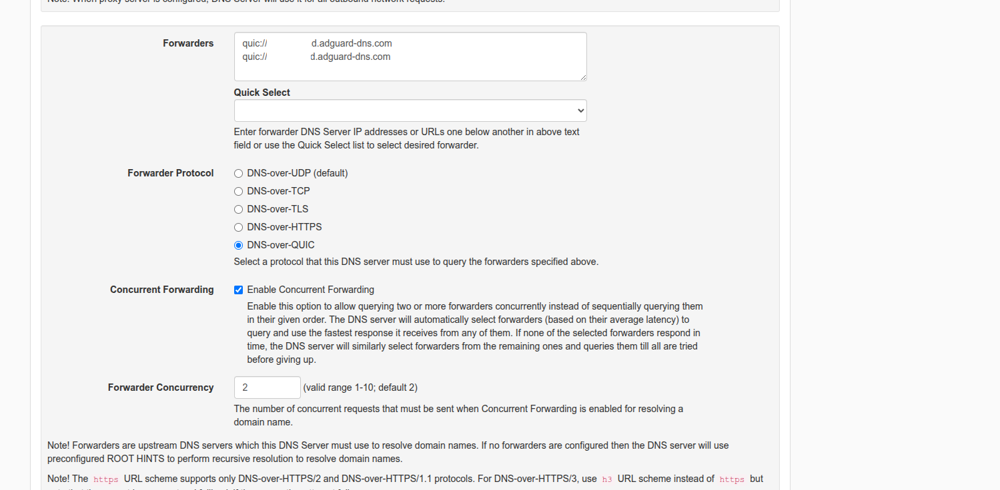
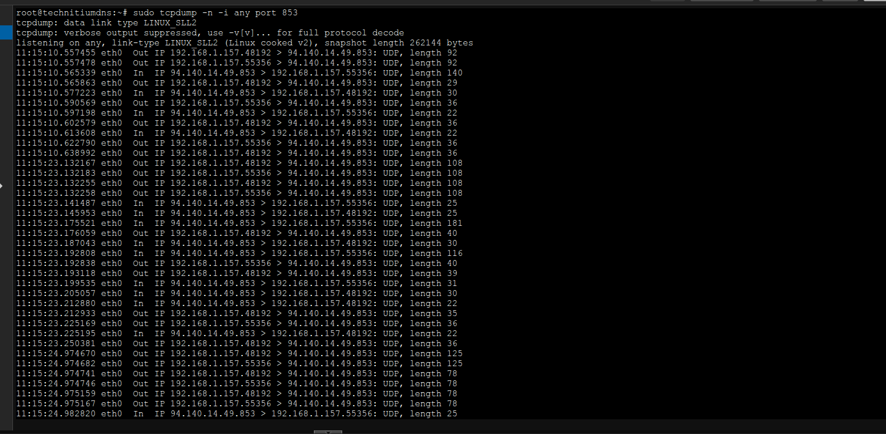

  

 
 

# Next-Gen Networking: IPv6 Dual-Stack, Infrastructure Observability & DNS Hardening

A production-grade network engineering framework demonstrating the deployment of native IPv6 Dual-Stack environments over restricted ISP boundaries, centralized infrastructure observability (Prometheus/Grafana), and next-generation cryptographic DNS privacy hardening (DNS-over-QUIC / DNS-over-TLS). The project focuses on solving complex Layer-3 routing loops, Neighbor Discovery Protocol (NDP) constraints over tunnels, and real-time telemetry extraction from embedded systems.

 

## 📋 Core Engineering Resolutions & Milestones

* 🌐 **Native IPv6 Tunneling via WireGuard Broker** – Bypassed native residential ISP IPv6 routing limitations by establishing an L3 WireGuard tunnel broker interface, provisioning a public `/64` IPv6 prefix down to isolated guest containers (AlmaLinux 10) running inside Proxmox VE.
* ⚡ **Routing Loop Elimination via Longest Prefix Match (LPM)** – Resolved a critical infrastructure failure where host traffic fell into an infinite loop (Hop Limit Exceeded). Mitigated by injecting a specific `/128` host route onto the local bridge, forcing the kernel execution path to prioritize local interface delivery over the global tunnel gateway default path.
* 🔄 **Layer-3 Neighbor Discovery Protocol (NDP) Proxying** – WireGuard operates as a pure L3 protocol and inherently drops L2 multicast Neighbor Solicitation frames. Deployed and tuned `ndppd` (NDP Proxy Daemon) on the Proxmox hypervisor to intercept and answer discovery solicitations on behalf of containers, achieving full external visibility.
* 🛡️ **Modern State Packet Filtering (nftables)** – Fully migrated the infrastructure security posture from legacy `ip6tables` to high-performance `nftables`. Enforced a strict "Default Drop" operational policy across the tunnel gateway while permitting stateful connection tracking (`established, related`) and explicit ICMPv6 diagnostics.
* 📊 **Observability & Custom Python Telemetry Exporters** – Implemented real-time tracking for legacy embedded architectures lacking standard package management systems. Deployed a lightweight custom Python telemetry daemon using the secure `wg show dump` abstraction pipeline to feed active handshake metrics and payload counters into a central Prometheus server and Grafana monitoring dashboard.
* 🚀 **Next-Gen DNS Privacy Layer (DNS-over-QUIC)** – Hardened the network against traffic analysis, MITM attacks, and tracking by upgrading the authoritative forwarding cluster from legacy plain-text UDP/53 and TCP-bound DNS-over-TLS (DoT) to **DNS-over-QUIC (DoQ, RFC 9250)**. This deployment natively eliminates Head-of-Line (HoL) blocking and leverages QUIC's connection migration features.

 
 

---

 

## 🔬 Project Documentation & Engineering Reports

The end-to-end technical blueprints, packet verification traces, and validation matrices are organized into three core engineering records within this repository:

 

### 📄 1. IPv6 Dual-Stack Architecture Blueprint
* **Description:** Comprehensive implementation guide mapping the L3 transport tunnel, custom `nftables` rulesets, NDP proxying verification, and system persistence parameters across virtualized containers.
 

* 👉 [Download IPv6 Dual-Stack Blueprint (PDF)](./Dual-Stack.pdf)

 

### 📄 2. Real-Time Infrastructure Monitoring & Telemetry Specification
* **Description:** Technical framework covering the deployment of Prometheus scrape targets, Custom Python WireGuard metrics extraction engines, and Grafana dashboard layout structures for tracking multi-peer tunnel performance.
 

* 👉 [Download Observability Specification (PDF)](./Real-Time Infrastructure Monitoring Embedded Systems & WireGuard Interface Health Tracking.pdf)

 

### 📄 3. Secure Infrastructure & DNS Privacy Hardening Report
* **Description:** Enterprise hardening guide detailing the elimination of plain-text DNS leaks, implementation of DNS-over-TLS (DoT via Port 853) with concurrent forwarding algorithms, and centralized local zone SSL/TLS validation profiles.
 

* 👉 [Download Observability Specification (PDF)](./Real-Time%20Infrastructure%20Monitoring%20Embedded%20Systems%20%26%20WireGuard%20Interface%20Health%20Tracking.pdf)

 
 

---

 

## 🔬 DNS-over-QUIC (DoQ) Operational Verification

### ⚙️ Authoritative Forwarder Cluster Configuration
Centralized upstream forwarding layer managed inside Technitium DNS server. The engine binds asynchronous execution trees over `quic://` transport schemas, pointing directly to encrypted low-latency Anycast routing topologies with concurrent multiplexing active.

  

### 🔍 Empirical Ingress Telemetry & Packet Analysis
A real-time network interface telemetry capture via `tcpdump -n -i any port 853` confirms structural handshake health. In contrast to standard DoT pipelines, the payload is natively bound to **stateless UDP frames** on port 853, verifying zero TCP transport boundaries and full integration of the next-generation QUIC framing engine.

  

 
 

---

 

*Disclaimer: This repository is part of a secure home-laboratory infrastructure designed exclusively for advanced Layer-3 routing prototyping, next-gen transport security analysis, and infrastructure observability research.*
